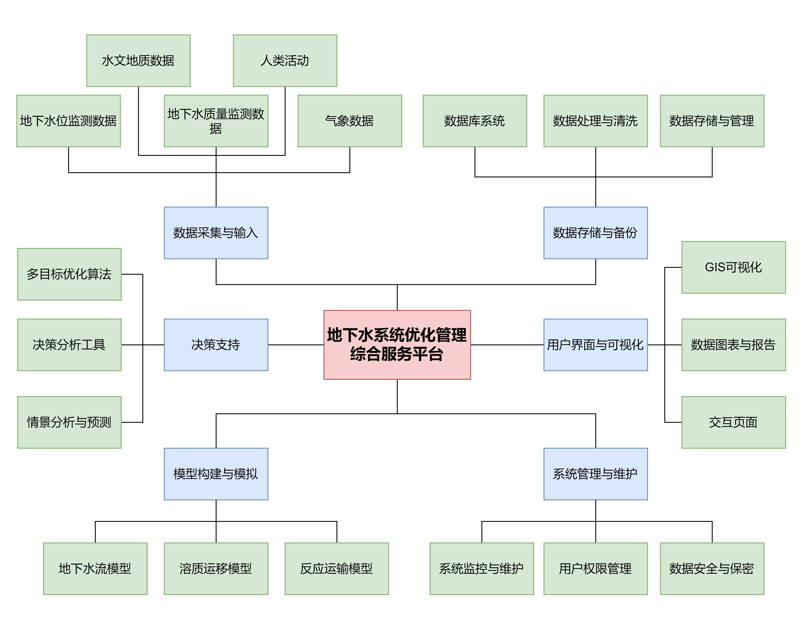

<h1 align="center">地下水系统优化管理综合服务平台</h1>

基于课题组已有的成果，我们致力于推出一个地下水系统优化管理综合服务平台，目前平台尚在开发阶段，敬请期待。

<h3>课题组简介</h3>
下面是骆乾坤老师的个人主页：https://faculty.hfut.edu.cn/lqk/zh_CN/index.htm
<h3>平台简介</h3>
下面是平台的功能支持简介。

